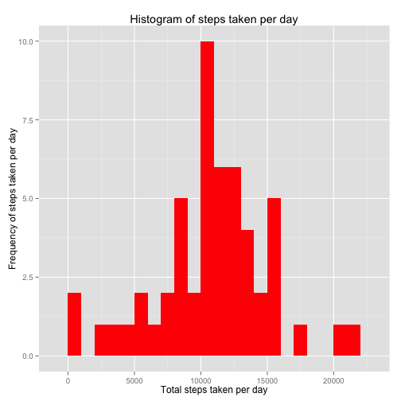
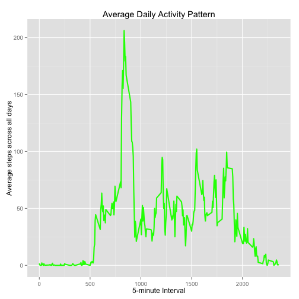
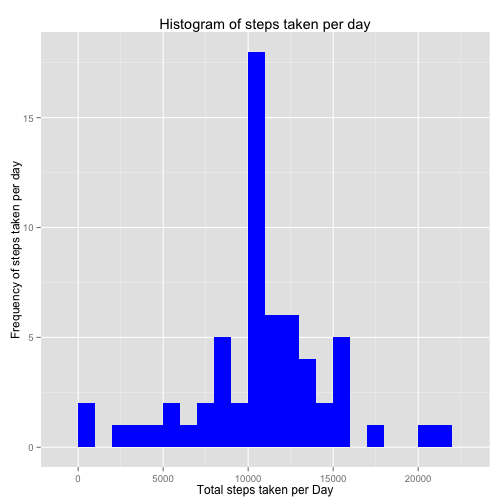
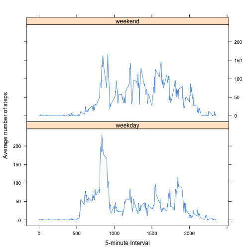

#### Load the required packages for analysis

```r
library(knitr)

library(ggplot2)
library(data.table)
```
###Loading and preprocessing the data


```r
 activ_monitor <- read.csv("~/Desktop/Coursera_wd/activity.csv", header= TRUE, sep=",")
 str(activ_monitor)
```

```
## 'data.frame':	17568 obs. of  3 variables:
##  $ steps   : int  NA NA NA NA NA NA NA NA NA NA ...
##  $ date    : Factor w/ 61 levels "2012-10-01","2012-10-02",..: 1 1 1 1 1 1 1 1 1 1 ...
##  $ interval: int  0 5 10 15 20 25 30 35 40 45 ...
```
#### Tidy the data 
- Convert the date to the date column to Date class and
- the interval column and to a Factor class

```r
activ_monitor$date <- as.Date(activ_monitor$date, format = "%Y-%m-%d")
activ_monitor$interval <- as.factor(activ_monitor$interval)
str(activ_monitor)
```

```
## 'data.frame':	17568 obs. of  3 variables:
##  $ steps   : int  NA NA NA NA NA NA NA NA NA NA ...
##  $ date    : Date, format: "2012-10-01" "2012-10-01" ...
##  $ interval: Factor w/ 288 levels "0","5","10","15",..: 1 2 3 4 5 6 7 8 9 10 ...
```
### Mean total number of steps taken per day
##### Calculate the total number of steps taken per day (Note: missing values ignored).

```r
total_daily_steps <- aggregate(steps ~ date, activ_monitor, sum)
str(total_daily_steps)
```

```
## 'data.frame':	53 obs. of  2 variables:
##  $ date : Date, format: "2012-10-02" "2012-10-03" ...
##  $ steps: int  126 11352 12116 13294 15420 11015 12811 9900 10304 17382 ...
```
 ##### Plot histogram of total steps taken per day.


```r
plot1 <- ggplot(total_daily_steps, aes(steps)) +
       geom_histogram(fill = "red", binwidth = 1000) + 
        labs(title="Histogram of steps taken per day", 
             x = "Total steps taken per day", y = "Frequency of steps taken per day") + theme_gray() 

print (plot1)
```

 
=================================================================================
#### Calculate mean and median of total steps taken per day

```r
mean_steps  <- mean(total_daily_steps$steps, na.rm=TRUE)
median_steps <- median(total_daily_steps$steps, na.rm=TRUE)

mean_steps
```

```
## [1] 10766.19
```

```r
median_steps
```

```
## [1] 10765
```
### Average daily activity pattern
 * Time series plot of the 5-minute interval and the average number of steps taken, averaged across all days.


```r
interval_steps <- aggregate(activ_monitor$steps, 
                                by = list(interval = activ_monitor$interval),
                                FUN=mean, na.rm=TRUE)

interval_steps$interval <- as.integer(levels(interval_steps$interval)[interval_steps$interval])
colnames(interval_steps) <- c("interval", "steps")
```
  * Plot the graph

```r
plot2 <- ggplot(interval_steps, aes(x=interval, y=steps)) +   
        geom_line(color="green", size=1) +  
        labs(title="Average Daily Activity Pattern", x="5-minute Interval", y="Average steps across all days") +  theme_gray()

print(plot2)
```

 
============================================================================================================

* 5-minute interval containing maximun steps


```r
interval_steps[which.max(interval_steps$steps),]
```

```
##     interval    steps
## 104      835 206.1698
```
 
### Imputing missing values

1. Total number of missing values

```r
  missing_values <- sum(is.na(activ_monitor$steps))
  table(missing_values)
```

```
## missing_values
## 2304 
##    1
```
 2. Strategy for filling in missing values into data

```r
 missingvalue_fill<- function(steps, interval) {
    mv_filled <- NA
    if (!is.na(steps))
        mv_filled <- c(steps)
    else
        mv_filled <- (interval_steps[interval_steps$interval==interval, "steps"])
    return(mv_filled)
}
```
3. new dataset with missing values filled in

```r
filled_activ_monitor <- activ_monitor
filled_activ_monitor$steps <- mapply(missingvalue_fill, filled_activ_monitor$steps, filled_activ_monitor$interval)
str(filled_activ_monitor)
```

```
## 'data.frame':	17568 obs. of  3 variables:
##  $ steps   : num  1.717 0.3396 0.1321 0.1509 0.0755 ...
##  $ date    : Date, format: "2012-10-01" "2012-10-01" ...
##  $ interval: Factor w/ 288 levels "0","5","10","15",..: 1 2 3 4 5 6 7 8 9 10 ...
```

```r
sum(is.na(filled_activ_monitor$steps))
```

```
## [1] 0
```
4a. Histogram of total number of steps taken each day


```r
filled_total_daily_steps <- aggregate(steps ~ date, filled_activ_monitor, sum)
colnames(filled_total_daily_steps) <- c("date","steps")


plot3 <- ggplot(filled_total_daily_steps, aes(steps)) + 
       geom_histogram(fill = "blue", binwidth = 1000) + 
        labs(title="Histogram of steps taken per day", 
             x = "Total steps taken per Day", y = "Frequency of steps taken per day") + theme_gray() 
print(plot3)
```

 

4b. Calculate mean and median

```r
 mean_steps_filled  <- mean(filled_total_daily_steps$steps, na.rm=TRUE)
median_steps_filled <- median(filled_total_daily_steps$steps, na.rm=TRUE)

mean_steps_filled
```

```
## [1] 10766.19
```

```r
median_steps_filled
```

```
## [1] 10766.19
```
 4c. Comparison of values form first and second part of assignment

```r
mean_steps
```

```
## [1] 10766.19
```

```r
median_steps
```

```
## [1] 10765
```

```r
mean_steps_filled
```

```
## [1] 10766.19
```

```r
median_steps_filled
```

```
## [1] 10766.19
```
From these values there is a slight difference in the median values but the mean reamins the same.    
4d. Impact of imputting missing data
 The impact seen here is that the frequecy of the steps taken increases.
 
### Differences in activity patterns between weekdays and weekends

* New factor variable for weekdays and weekends

```r
head(filled_activ_monitor)
```

```
##       steps       date interval
## 1 1.7169811 2012-10-01        0
## 2 0.3396226 2012-10-01        5
## 3 0.1320755 2012-10-01       10
## 4 0.1509434 2012-10-01       15
## 5 0.0754717 2012-10-01       20
## 6 2.0943396 2012-10-01       25
```

```r
filled_activ_monitor$weekdays <- factor(format(filled_activ_monitor$date, "%A"))
levels(filled_activ_monitor$weekdays)
```

```
## [1] "Friday"    "Monday"    "Saturday"  "Sunday"    "Thursday"  "Tuesday"  
## [7] "Wednesday"
```

```r
levels(filled_activ_monitor$weekdays) <- list(weekday = c("Monday", "Tuesday",
                                             "Wednesday", 
                                             "Thursday", "Friday"),
                                 weekend = c("Saturday", "Sunday"))
levels(filled_activ_monitor$weekdays)
```

```
## [1] "weekday" "weekend"
```

```r
table(filled_activ_monitor$weekdays)
```

```
## 
## weekday weekend 
##   12960    4608
```
 
 * Panel plot 

```r
avg_steps <- aggregate(filled_activ_monitor$steps, 
                      list(interval = as.numeric(as.character(filled_activ_monitor$interval)), 
                           weekdays = filled_activ_monitor$weekdays),
                      FUN = "mean")
names(avg_steps)[3] <- "meanOfSteps"
library(lattice)

plot4 <- xyplot(avg_steps$meanOfSteps ~ avg_steps$interval | avg_steps$weekdays, 
       layout = c(1, 2), type = "l", 
       xlab = "5-minute Interval", ylab = "Average number of steps")
print(plot4)
```

 
